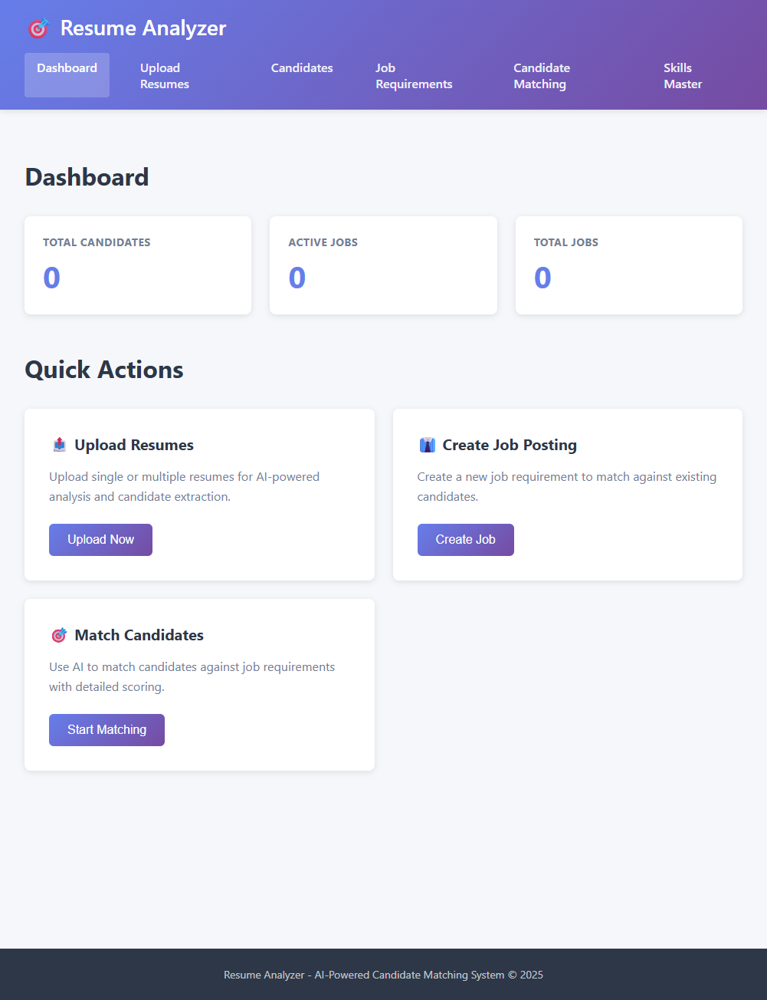
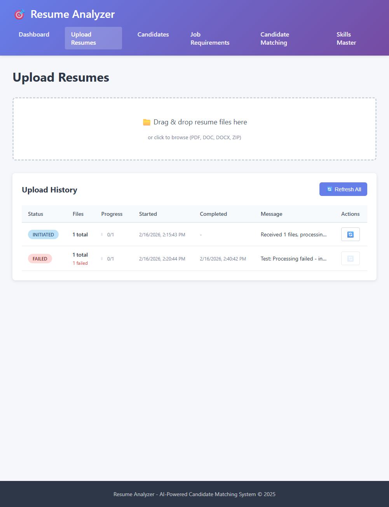
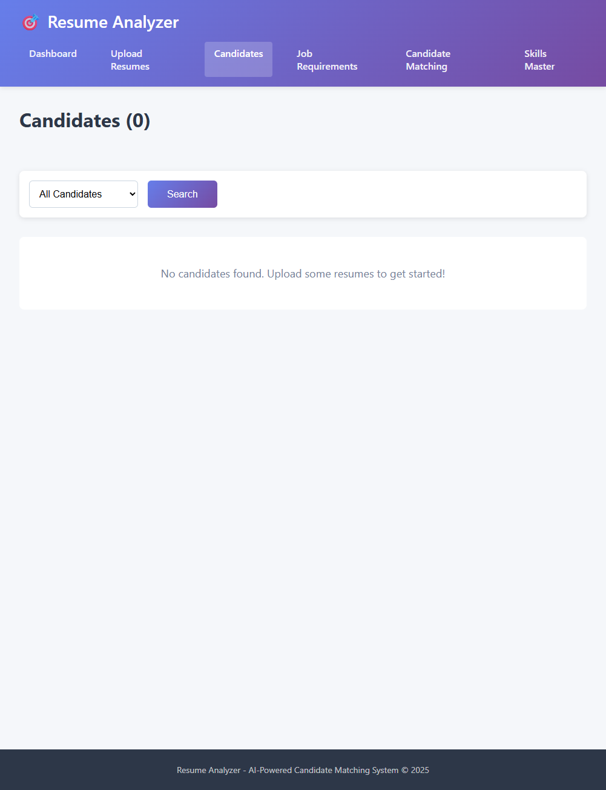
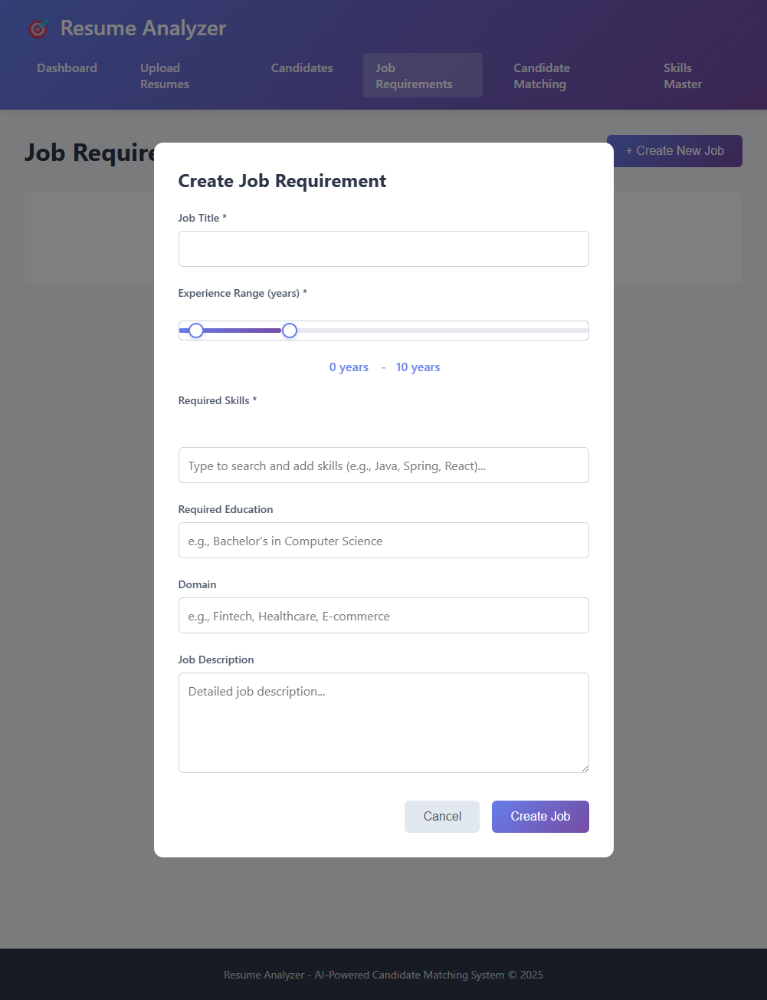
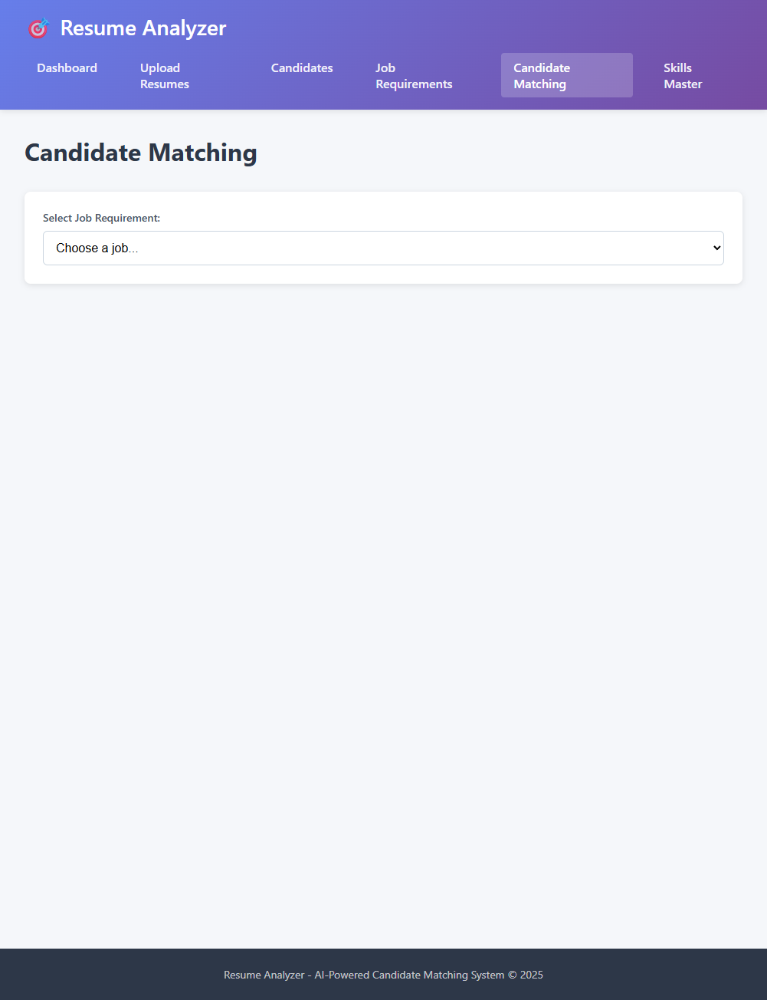

# 🚀 HireSense – AI Recruitment Intelligence Platform

<p align="center">
  <b>AI-powered Recruitment Intelligence Platform for Intelligent Resume Parsing, Semantic Candidate Matching, ATS Scoring, and Recruitment Workflow Automation.</b>
</p>

<p align="center">


</p>

---

# 📌 Overview

HireSense is an enterprise-grade AI Recruitment Intelligence Platform designed to simplify and automate modern hiring workflows.

The platform combines Artificial Intelligence, Semantic Search, Large Language Models (LLMs), and Vector Embeddings to transform traditional resume screening into an intelligent recruitment process.

Instead of relying on keyword matching, HireSense understands the semantic meaning of candidate profiles and job descriptions, enabling recruiters to identify the most relevant candidates with significantly higher accuracy.

The application provides recruiters with an end-to-end hiring solution including intelligent resume parsing, AI-powered candidate ranking, ATS score generation, recruiter dashboards, secure role-based authentication, semantic search, and recruitment analytics.

---

# ✨ Key Features

## 🤖 AI Resume Intelligence

* AI-powered resume parsing
* Automatic skill extraction
* Experience analysis
* Education extraction
* Candidate profile generation

---

## 🎯 Intelligent Candidate Matching

* Semantic Candidate–Job Matching
* AI-based Candidate Ranking
* ATS Compatibility Score
* Skill Gap Analysis
* Explainable AI Matching Results

---

## 🧠 Agentic AI & Retrieval-Augmented Generation (RAG)

* Retrieval-Augmented Generation (RAG)
* Vector Embeddings using pgvector
* Context-aware Resume Analysis
* AI-assisted Candidate Evaluation
* Intelligent Profile Enrichment

---

## 👥 Recruiter Workspace

* Recruiter Dashboard
* Candidate Management
* Job Requirement Management
* Recruitment Analytics
* Hiring Workflow Tracking

---

## 🔐 Enterprise Security

* JWT Authentication
* Spring Security
* Role-Based Access Control (RBAC)
* Protected APIs
* Secure Session Management

---

## ⚡ Performance & Scalability

* GraphQL APIs
* Redis Caching
* Dockerized Deployment
* Modular Spring Boot Architecture
* PostgreSQL with pgvector
* Asynchronous Processing

---

# 🛠 Technology Stack

| Category           | Technologies                                                                 |
| ------------------ | ---------------------------------------------------------------------------- |
| **Backend**        | Java 25, Spring Boot, Spring AI, Spring Security, Spring Data JPA, Hibernate |
| **Frontend**       | React, TypeScript, Redux Toolkit, Redux Saga                                 |
| **Database**       | PostgreSQL, pgvector, Redis                                                  |
| **API**            | GraphQL, REST APIs                                                           |
| **AI & ML**        | LLM Studio, Vector Embeddings, RAG, Semantic Search                          |
| **Authentication** | JWT Authentication, Role-Based Access Control                                |
| **DevOps**         | Docker, Maven                                                                |
| **Testing**        | JUnit 5, Mockito, Vitest, Playwright                                         |

---

# 🎯 Core Modules

* Resume Upload & Processing
* AI Resume Parsing
* Candidate Management
* Job Requirement Management
* Intelligent Candidate Matching
* ATS Score Generation
* Recruiter Dashboard
* Authentication & RBAC
* Recruitment Analytics
* AI Profile Enrichment

---

# 🌟 Why HireSense?

Unlike conventional Applicant Tracking Systems that rely on keyword matching, HireSense leverages Artificial Intelligence, Vector Search, and Large Language Models to understand the semantic context of resumes and job descriptions.

This enables recruiters to make faster, smarter, and more accurate hiring decisions while significantly reducing manual screening effort.

````markdown
# 🏗 System Architecture

```text
                           +----------------------+
                           |      React UI        |
                           |  Recruiter Dashboard |
                           +----------+-----------+
                                      |
                                      |
                               GraphQL / REST
                                      |
                                      |
+-----------------------------------------------------------------------+
|                         Spring Boot Backend                           |
|                                                                       |
|  Authentication │ Resume Parser │ Matching │ Analytics │ AI Engine    |
|                                                                       |
+-----------------------------------------------------------------------+
          |                     |                     |
          |                     |                     |
     PostgreSQL            Spring AI            Redis Cache
      + pgvector             (LLM)               (Caching)
          |                     |
          +---------- Vector Search ------------+
````

---

# 🔄 Application Workflow

```text
Resume Upload
      │
      ▼
Resume Parsing
      │
      ▼
Skill & Experience Extraction
      │
      ▼
Vector Embedding Generation
      │
      ▼
Semantic Candidate Matching
      │
      ▼
ATS Score Generation
      │
      ▼
Candidate Ranking
      │
      ▼
Recruiter Dashboard
```

---

# 📂 Project Structure

```
HireSense
│
├── backend/
│   ├── authentication
│   ├── ai
│   ├── graphql
│   ├── matching
│   ├── candidate
│   ├── jobs
│   ├── analytics
│   ├── repository
│   ├── services
│   ├── security
│   └── config
│
├── frontend/
│   ├── components
│   ├── pages
│   ├── redux
│   ├── graphql
│   ├── services
│   ├── hooks
│   └── utils
│
├── docker/
│
├── docs/
│
└── test-data/
```

---

# 📸 Screenshots

## Dashboard

> Recruiter dashboard providing hiring statistics, candidate insights, and recruitment analytics.

<p align="center">

</p>

---

## Resume Upload

> Upload multiple resumes with real-time processing and AI-powered parsing.

<p align="center">

</p>

---

## Candidate Management

> Browse, filter, and manage candidate profiles with semantic search capabilities.

<p align="center">

</p>

---

## Job Requirements

> Create and manage job descriptions with intelligent skill recommendations.

<p align="center">

</p>

---

## Candidate Matching

> AI-powered semantic candidate ranking with ATS scores and explainable matching.

<p align="center">

</p>

---

# 📈 Key Highlights

* AI-powered Resume Parsing
* Semantic Candidate Ranking
* ATS Compatibility Scoring
* GraphQL API Architecture
* Spring AI Integration
* PostgreSQL + pgvector
* Enterprise RBAC
* Dockerized Deployment
* Modern React Dashboard
* Recruiter Analytics

```
```

````markdown
# 🚀 Getting Started

## Prerequisites

Before running the project, ensure the following tools are installed:

- Java 25+
- Node.js 20+
- Maven
- PostgreSQL 15+
- Docker (Optional)
- LM Studio (for Local LLM)
- Git

---

# ⚙️ Installation

## Clone Repository

```bash
git clone https://github.com/msrajput08/springboot-ai-recruitment-platform.git

cd springboot-ai-recruitment-platform
````

---

## Backend Setup

```bash
mvn clean install

mvn spring-boot:run
```

Backend will start on:

```
http://localhost:8080
```

---

## Frontend Setup

```bash
cd src/main/frontend

npm install

npm run dev
```

Frontend will start on:

```
http://localhost:3000
```

---

# 🐳 Docker Deployment

Build Docker Image

```bash
docker-compose up --build
```

Run in Detached Mode

```bash
docker-compose up -d
```

Stop Containers

```bash
docker-compose down
```

---

# 🔐 Authentication

HireSense implements enterprise-grade authentication using:

* JWT Authentication
* Spring Security
* Role-Based Access Control (RBAC)
* Protected GraphQL APIs
* Secure REST Endpoints

Supported Roles

* Administrator
* Recruiter
* HR
* Hiring Manager

---

# 📡 API Architecture

The application exposes two APIs:

### GraphQL

Used for

* Candidate Management
* Job Management
* Candidate Matching
* Recruiter Dashboard
* Analytics

### REST APIs

Used for

* Resume Upload
* Authentication
* File Processing
* Utility Services

---

# 🤖 AI Pipeline

The intelligent recruitment pipeline follows the workflow below:

Resume Upload

↓

Resume Parsing

↓

Candidate Profile Generation

↓

Embedding Creation

↓

Semantic Search

↓

AI Matching

↓

ATS Score

↓

Candidate Ranking

↓

Recruiter Dashboard

---

# 📊 Performance Features

* Semantic Vector Search
* AI-powered Resume Parsing
* GraphQL Optimized Queries
* Redis Caching
* Dockerized Deployment
* Modular Spring Boot Architecture
* Asynchronous Processing
* PostgreSQL + pgvector

---

# 🗺 Roadmap

### Phase 1

* Resume Parsing
* Candidate Management
* Job Management

### Phase 2

* AI Candidate Matching
* Semantic Search
* ATS Score Generation

### Phase 3

* Recruiter Dashboard
* Analytics
* Candidate Ranking

### Phase 4

* Multi-LLM Support
* Interview Scheduling
* Cloud Deployment
* Enterprise Integrations

---

# 🤝 Contributing

Contributions are welcome.

1. Fork the repository.

2. Create a feature branch.

```bash
git checkout -b feature/your-feature
```

3. Commit your changes.

```bash
git commit -m "Add new feature"
```

4. Push the branch.

```bash
git push origin feature/your-feature
```

5. Open a Pull Request.

---

# 📜 License

This project is licensed under the MIT License.

---

# ⭐ Support

If you found this project useful, consider giving it a ⭐ on GitHub.

---

# 👨‍💻 Author

**Mohitsing Patil**

LinkedIn:
https://linkedin.com/in/mohitsing-patil

GitHub:
https://github.com/msrajput08

---

<p align="center">

Made with ❤️ using Java, Spring Boot, React, Spring AI and PostgreSQL

</p>
```
